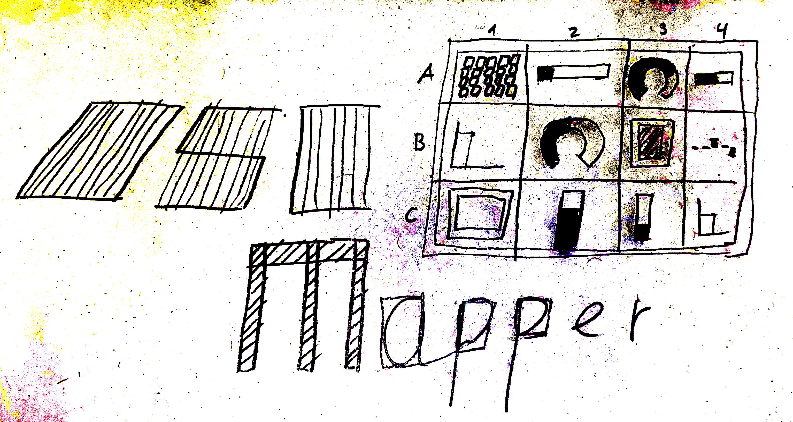

# OSC Mapper



A high level library to interact with SuperCollider via an OSC controller.
Allows to use an OSC layout which is

* pre-defined as preset (e.g. Mix 2 from TouchOSC)
* custom defined as code
* learned by modifying the controllers

and use the values of the controller as

* within a Synth as a `Bus` or a `Ndef`
* within the language via `.value` or via a callback to controll e.g. effects
* within a Pattern via `Pdefn`

## Installation

```supercollider
// install the quark
Quarks.install("https://github.com/capital-G/OSCMapper.git");
// restart the interpreter so the new classes are available
thisProcess.recompile;
// open documention
HelpBrowser.openHelpFor("Classes/OSCMapper");
```

## Quickstart

### Creating a layout

You can either define the layout manually

```supercollider
(
o = OSCMapper(\myLayout, (
    '/1/fader1': OSCMapperFader(
        altName: \fader1,
        defaultValue: 0.5,
        transformer: linlin(_, 0.0, 1.0, 0.5, 10.0),
        callback: {|v| ["received a value", v].postln;},
        lag: 0.5,
    ),
    '/1/xy1': OSCMapperXY(
        altName: \touchPanel
    ),
));
```

or use a preset like `Mix 2` from TouchOSC like

```supercollider
o = OSCMapper.mix2(\myLayout);
```

or learn a custom controller on the fly

```supercollider
OSCMapper.learn;
// move controls
o = OSCMapper.finishLearn(\myLayout);
```

### Using the controller within SuperCollider

#### As Ndef

```supercollider
// the osc mapper we created earlier can also be accessed in def style
o = OSCMapper(\myLayout);

Ndef(\mySine, {SinOsc.ar!2 * o['/1/fader1'].asNdef}).play;

Ndef(\mySine).clear(2);
```

#### As bus

```supercollider
// use the default synth
s = Synth(\default);
s.map(\amp, o['/1/fader1'].asBus);
s.free;
```

#### In a pattern via Pdefn

```supercollider
(
p = Pbind(
    \instrument, \default,
    \dur, 0.5,
    \degree, Pxrand((0..10), inf),
    \amp, o['/1/fader1'].asPdefn,
).play;
)

p.stop;
```

#### As raw value access

```supercollider
o['/1/fader1'].value;
```

#### Add a callback on change

```supercollider
o['/1/fader1'].callback = {|v| "value is now %".format(v).postln};
// and free the callback
o['/1/fader1'].callback = {};
```

## License

GPL-2.0
